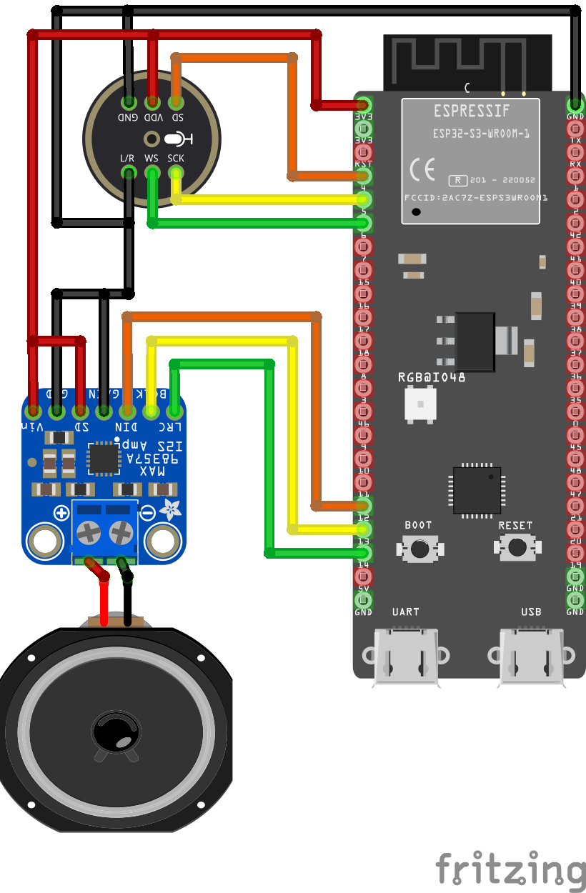

# Host MicroClient

The Digital Assistant Client can also be installed on microcontroller. Although this is the cheapest hardware option, it is also the most complicated one.

# Needed Hardware

- Microcontroller ESP32-S3, for example the [DevKitC Version](https://www.amazon.de/gp/product/B0CLD4QKT1/ref=ppx_yo_dt_b_search_asin_title?ie=UTF8&th=1) of it. Make sure it have more than 2 MB PSRAM available.
- Any digital microphone with an I2S interface can be used as a microphone. In the example, the microphone [INMP441](https://www.berrybase.de/inmp441-mems-omnidirektionales-mikrofonmodul-i2s-interface) is used
- Any I2S module can also be used as a loudspeaker. In this example, the amplifier [MAX98357A](https://www.adafruit.com/product/3006) connected to a [3 Watt loudspeaker](https://www.adafruit.com/product/1314) is used.
- Some cable for the connections
- A case, with the modules used in the example, the [designed case](https://github.com/PALs-Software/DigitalAssistant/tree/main/3D-Models) in this project can be printed out using a 3D printer.

# Circuit diagram
The I2S-Interfaces are preconfigured to the following pins. But the numbers can be changed in the `config.h` file of the MicroClient project.

### Microphone Configuration
- Serial Clock Pin (SCK): 5
- Left Right Clock Pin (WS): 6
- Serial Data Pin (SD): 4

### Speaker Configuration
- Serial Clock Pin (SCK): 13
- Left Right Clock Pin (WS): 14
- Serial Data Pin (SD): 12
  

# Installation

1. Install the [PlatformIO extension](https://platformio.org/install/ide?install=vscode) in the visual studio code environment.
2. Clone the [digital assistant repository](https://github.com/PALs-Software/DigitalAssistant) from github.
3. Open the `Core/DigitalAssistant.MicroClient` project in visual studio code.
4. Plugin your ESP32-S3 with the USB-C COM Port to your computer.
5. Configure your wifi ssid and password in the `config.h` file in the project.
6. Configure your upload and optionally your monitor port where the microcontroller is connected to in the `platformio.ini` file.
7. Navigate in the sidebar to the PlatformIO extension.
8. Select the action upload or upload and monitor.

Further information's how to connect the client with the server can be found in the [setup client](../setup/clients.md) chapter of this documentation.